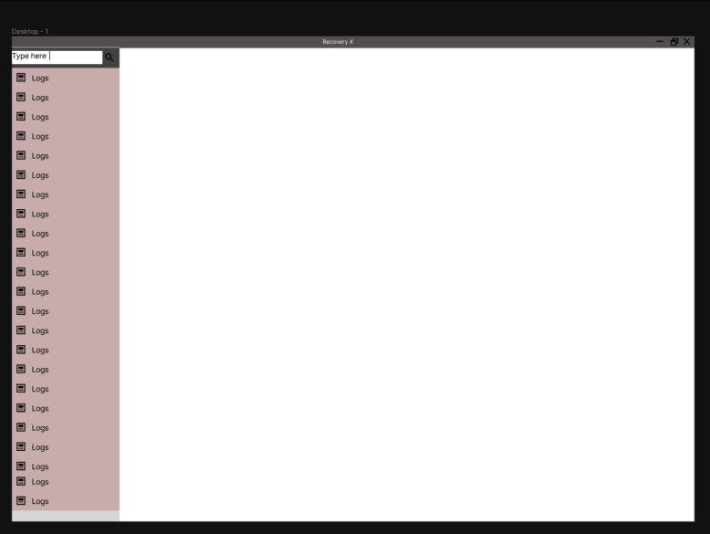

<p align="center">
  
</p>
<h1 align="center">RecoveryX</h1>
<p align="center">A linux troubleshoot & repairtool</p>
<div align="center">


  <hr />
  
<br> </br>
</div>


<h1>RecoveryX is a linux repair & troubleshoot tool.</h1> 

### Meant for users to repair their machine via a simple to use interface or if that's not possible to generate logs so other people can support them easier. </br> 

### RecoveryX was designed using flutter 

### Check out the wiki for guides on how to use **RecoveryX**
</br></br></br></br></br></br></br>

**Features**
 - Repairing grub
 - Automatic Chroot
 - Logging (Pacman, systemd log, journal errors)
 - Password reset
 - Fix update problems
 - Get hardware info
 - Disk checking 
 - Memory checking 
 
</br></br></br></br></br></br></br></br></br>

### How to build from source
</br>

**Dependecies** uses the Arch Linux package names
```
memtester
inxi
badblocks
smarctl
fsck
```
**Steps to build from source**
```
1.  Clone repository
2.  cd nametoadd
3.  the other steps
```

### Donate stuff
[Patreon](https://patreon.com/rebornos)

### 3rd party packages
[LibAdwaita Flutter implementation](https://github.com/gtk-flutter/libadwaita)

